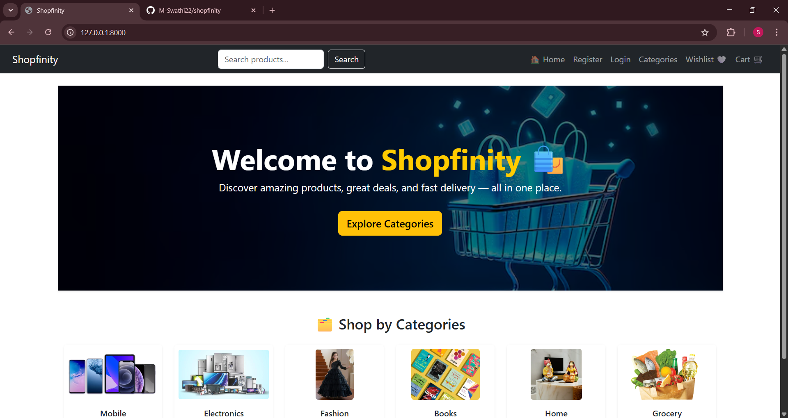
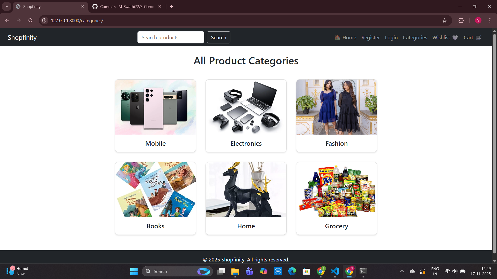

# 🛍️ e-website – E-commerce Website using Django

This is a full-featured e-commerce website built using Django, MySQL, HTML, CSS, Bootstrap, and JavaScript. It includes user authentication, product listing, cart, wishlist, order placement, and Stripe payment gateway.

---

## 🚀 Features

- 🧑‍💻 User Registration and Login
- 🗂️ Product Categories: Mobile, Electronics, Books, Fashion, Home, Grocery
- 📦 Product Listing with Details
- 🛒 Cart Functionality (Add, Remove, Quantity)
- ❤️ Wishlist Feature
- 📍 Address Collection at Checkout
- 📦 Order Confirmation & Placement
- 💳 Stripe Payment Integration
- 🔐 Secure Configuration (`settings_.py` for sensitive info)
- 📦 GitHub `.gitignore` for virtual env and DB credentials
- 📱 Mobile responsive design using Bootstrap

---

## 🛠️ Tech Stack

- **Frontend:** HTML, CSS, JavaScript, Bootstrap
- **Backend:** Python, Django
- **Database:** MySQL
- **Payment:** Stripe

---

ecommerce_shopfinity/
│
├── ecommerce_project/                  # Main Django project folder
│   │
│   ├── ecommerce_project/              # Project settings package
│   │   ├── __init__.py
│   │   ├── asgi.py
│   │   ├── settings.py
│   │   ├── settings_secret.py          # Gitignored — contains DB & keys
│   │   ├── urls.py
│   │   ├── wsgi.py
│   │
│   ├── ecommerce_app/                  # Main application
│   │   ├── migrations/                 # Auto-generated DB migrations
│   │   ├── static/                     # CSS, JS, images
│   │   ├── templates/                  # HTML templates
│   │   ├── __init__.py
│   │   ├── admin.py
│   │   ├── apps.py
│   │   ├── models.py
│   │   ├── urls.py
│   │   ├── views.py
│   │
│   ├── media/                          # Uploaded product images
│   ├── manage.py                       # Django management file
│
├── ecommerce_site/                     # Virtual environment (ignored)
│   ├── Lib/
│   ├── Scripts/
│   ├── pyvenv.cfg
│
├── screenshots/                        # Project screenshots for README
│   ├── home.png
│   ├── category.png
│   ├── product.png
│   ├── cart.png
│   ├── payment_success.png
│
├── .gitignore                          # Git ignore rules
├── README.md                           # Project documentation

### 🏠 Home Page

